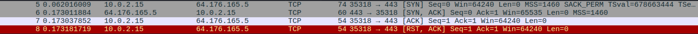
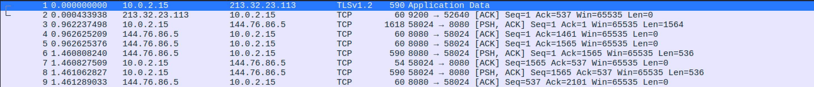

# The Hidden Danger Behind Kali's `nmap` Installation

Recently while preparing materials for a scanning lesson for my students I encountered an interesting behavior while running good
old `nmap`. On the surface this discovery seems minor and positive from usage point of view. But it might lead to dangerous consequences 
and disclose the identity of the scanner if ignored.


## Default `nmap` Scan Behavior

`Nmap` has many scan options, among them there are `-sS` (stealth scan) and `-sT` (connect scan). By default when `nmap` is executed as
root it uses the stealth scan, when running `nmap` as a regular user, it uses the connect scan.

Without diving too deep, the main difference between a stealth scan and a connect scan is in the number of packets used and needed
permissions. Stealth scan creates a little less "noise" to identify an open port. This "stealthy" behavior requires raw network access 
which is available only to the `root` user unless special configurations are made.

The screenshots below show the difference between a stealth scan and a connect scan as seen in Wireshark.

Command: `nmap -p 443 -Pn -n grishuk.co.il -sS`


Command: `nmap -p 443 -Pn -n grishuk.co.il -sT`




## Using Proxy Servers

In some cases, when running a scan against a target, we have to use proxy servers. Those can be manually set up proxies, open available
servers or even the Tor network.

*There are many ways to proxify scans, the mentioned above methods are just few examples.*

`Nmap` has a built in `--proxies` option, but it is a topic for another time, as based on multiple execution attempts I did not manage to 
make it work which leads to a another conversation.
One of the common solutions that allows to proxify the scan is a tool called [`proxychains`](https://github.com/rofl0r/proxychains-ng). 
`proxychains` allows to easily create a chain of proxy servers and route TCP traffic of any tool through that chain of proxy servers 
(thus the name). One of the most common use cases for such proxying is proxying of traffic via the Tor network.

To send traffic via the chain of proxies, we simply have to call the `proxychains` command before the command that we are using.
For example, a `curl` request can be proxied like this.

```txt
$ curl https://myip.wtf/json 

{
  "YourIPAddress": "1.2.3.4",
  "YourLocation": "Tel Aviv, TA, Israel",
  "YourHostname": "1.2.3.4",
  "YourISP": "The name of your ISP",
  "YourTorExit": false,
  "YourCity": "Tel Aviv",
  "YourCountry": "Israel",
  "YourCountryCode": "IL"
}
```

```txt
proxychains curl https://myip.wtf/json 
[proxychains] config file found: /etc/proxychains.conf
[proxychains] preloading /usr/lib/x86_64-linux-gnu/libproxychains.so.4
[proxychains] DLL init: proxychains-ng 4.17
[proxychains] Strict chain  ...  127.0.0.1:9050  ...  myip.wtf:443  ...  OK

{
  "YourIPAddress": "2.58.56.220",
  "YourLocation": "Lelystad, FL, Netherlands",
  "YourHostname": "2.58.56.220.powered.by.rdp.sh",
  "YourISP": "1337 Services GmbH",
  "YourTorExit": true,
  "YourCity": "Lelystad",
  "YourCountry": "Netherlands",
  "YourCountryCode": "NL"
}
```

*`curl` specifically has a built in ability to proxy the request, here it is used as an example.*

Same approach can be used with `nmap`. But here lays the hidden twist. `proxychains` can proxy only full TCP connections, it cannot 
handle `nmap`'s stealth scan. When running a stealth scan via `proxychains` it does nothing. Simply speaking, attempting a stealth scan 
via `proxychains` will result in exposure of the real IP address of the scanner. Take a look at the following examples.

1. `nmap` scan with `proxychains` with full TCP connect scan.

Command:

```txt
$ sudo proxychains nmap -p 443 -Pn -n 64.176.165.5 -sT

[proxychains] config file found: /etc/proxychains.conf
[proxychains] preloading /usr/lib/x86_64-linux-gnu/libproxychains.so.4
[proxychains] DLL init: proxychains-ng 4.17
[proxychains] DLL init: proxychains-ng 4.17
[proxychains] DLL init: proxychains-ng 4.17
[proxychains] DLL init: proxychains-ng 4.17
Starting Nmap 7.98 ( https://nmap.org ) at 2026-03-21 10:08 -0400
[proxychains] Strict chain  ...  127.0.0.1:9050  ...  64.176.165.5:443  ...  OK
Nmap scan report for 64.176.165.5
Host is up (0.00s latency).

PORT    STATE SERVICE
443/tcp open  https

Nmap done: 1 IP address (1 host up) scanned in 0.51 seconds
```




2. `nmap` stealth scan with `proxychains`.

Command:

```txt
$ sudo proxychains nmap -p 443 -Pn -n 64.176.165.5 -sS

[proxychains] config file found: /etc/proxychains.conf
[proxychains] preloading /usr/lib/x86_64-linux-gnu/libproxychains.so.4
[proxychains] DLL init: proxychains-ng 4.17
[proxychains] DLL init: proxychains-ng 4.17
[proxychains] DLL init: proxychains-ng 4.17
[proxychains] DLL init: proxychains-ng 4.17
Starting Nmap 7.98 ( https://nmap.org ) at 2026-03-21 10:11 -0400
Nmap scan report for 64.176.165.5
Host is up (0.0093s latency).

PORT    STATE SERVICE
443/tcp open  https

Nmap done: 1 IP address (1 host up) scanned in 0.08 seconds
```


As you can see from Wireshark's and `proxychains` output, the second scan completely ignored the proxy server/s and sent the TCP
probe directly to the target, thus exposing the IP address of the scanner.
Such a behavior might put at risk the scanner for various reasons.

Since on Kali, nmap uses stealth scan even when executed as a regular user, such a behavior poses a threat for the less advanced users.

*The paranoids between us might think that it was done intentionally to expose "script kiddies" ;)*


## Nmaps installation on Kali and Other Distributions

Let's dive a little deeper to understand why `nmap` runs a stealth scan when executed as a regular user and how does it differ from other
`nmap` installations on other distributions.

Running the `which` command on `nmap` shows that the executable file for `nmap` is located at `/usr/bin/nmap` which is completely normal.

```bash
$ which nmap

/usr/bin/nmap
```

But when running the `file` command, we discover that it is not an ELF file but a shell script that looks as follows:

```bash
$ cat /usr/bin/nmap 

#!/usr/bin/env sh

set -e

if [ "$(id -u)" -eq 0 ] || [ "$1" = "--resume" ]; then
  exec /usr/lib/nmap/nmap "$@"
else
  exec /usr/lib/nmap/nmap --privileged "$@"
fi
```

So based on the wrapper script, if `nmap` is executed as `root` it simply passes all the command line arguments to the actual 
executable file at `/usr/lib/nmap/nmap` which is the actual binary ELF file. But when running `nmap` as a non root user, 
it calls the same binary with the `--privileged` option.

On Linux, there are two ways to run programs with high privileges while executing them as a regular user
(without `sudo`, `su` or `pkexec`).

Option 1: Set-UID.
Option 2: Capabilities.

Checking the permissions of the `/usr/lib/nmap/nmap` file shows that it does not have any special permissions (no set-UID).

```bash
$ ls -l /usr/lib/nmap/nmap

-rwxr-xr-x 1 root root 2952824 Dec 17 08:47 /usr/lib/nmap/nmap
```

But, running the `getcap` command (which is used to list the extra capabilities of a file) shows that it has three capabilities set.

```bash
getcap /usr/lib/nmap/nmap

/usr/lib/nmap/nmap cap_net_bind_service,cap_net_admin,cap_net_raw=eip
```

- **CAP_NET_BIND_SERVICE**: Allows binding to privileged ports (below 1024) without running as root.
- **CAP_NET_ADMIN**: The broad networking administration capability. Covers interface configuration (IP addresses, routes, MTU), firewall rules (iptables/nftables), network namespace manipulation, setting promiscuous mode, modifying routing tables, and tweaking socket buffer sizes.
- **CAP_NET_RAW**: Allows opening raw sockets (AF_PACKET, SOCK_RAW) and using ping (ICMP). Needed for packet sniffing, crafting custom packets, or any tool that works below the transport layer (tcpdump, nmap SYN scans, scapy, etc.).


## Summary

Kali Linux's `nmap` installation differs from other distributions in a subtle but important way. Through a wrapper script and Linux capabilities (`CAP_NET_RAW`, `CAP_NET_ADMIN`, `CAP_NET_BIND_SERVICE`), it allows stealth scans even as a non-root user, a convenience that becomes a liability when combined with proxy tools like proxychains.

Since `proxychains` can only intercept full TCP connections and not raw socket operations, a stealth scan silently bypasses the proxy chain entirely, sending packets directly from your real IP address. On standard Linux distributions this isn't an issue because unprivileged users default to `-sT` (connect scan), which works correctly through proxychains. But on Kali, the `--privileged` flag makes `-sS` the default for all users, creating a false sense of anonymity.               

When scanning through proxies on Kali, always explicitly specify `-sT`. Don't assume the proxy is working, verify it in Wireshark.
A stealth scan that exposes your real IP to the target is the opposite of stealthy.
